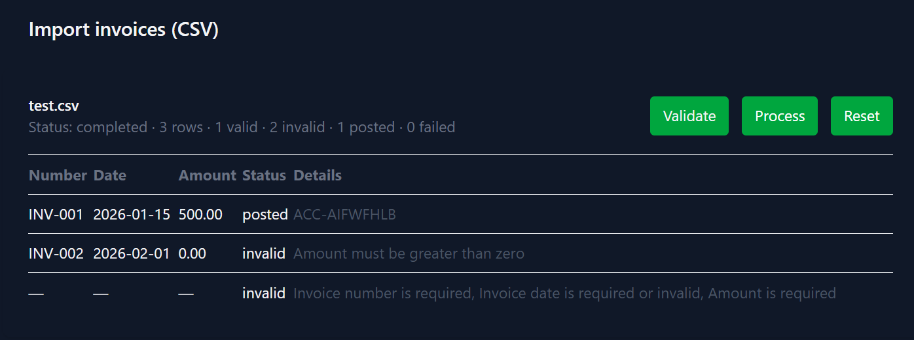

# Invoice Import Tool

A batch invoice importer that parses CSV files, validates rows, and posts valid
invoices to an external accounting system through a swappable integration layer.

Built to model a real-world accounting-integration workflow: stateful multi-step
processing, bulk submission, partial-failure handling and per-invoice result tracking.

## Stack

- Laravel 13, Livewire 4 (TALL stack)
- SQLite (swappable via standard Laravel config)
- Pest for tests

## What it does

1. **Upload** a CSV of invoices (invoice_number, invoice_date, amount, currency).
2. **Validate** rows against required-field rules; invalid rows are flagged with
   per-field errors and never sent downstream.
3. **Process** valid rows: submitted to the accounting API in bulk (50 per batch),
   each invoice marked `posted` (with the external reference returned) or `failed`
   (with the error captured).
4. **Review** per-invoice results and batch-level summary counts.



## Architecture

The design keeps the UI thin and isolates the external system behind a contract:

- **Domain** (`app/Models`, `app/Enums`) — `ImportBatch` has many `Invoice`s;
  status enums model the lifecycle (`pending → valid/invalid → posted/failed`).
- **Services** (`app/Services`) — `BatchImporter` (CSV parsing), `BatchValidator`
    (validation rules), `BatchProcessor` (bulk submission, status reconciliation)
- **Integration** (`app/Integrations`) — `AccountingApi` interface +
  `InvoiceResult` / `AuthResult` DTOs. `FakeAccountingApi` simulates the remote
  system (auth, duplicate detection, bulk responses). A real SDK
  can be swapped in by changing a single container binding.
- **UI** (`app/Livewire/InvoiceImporter`) — a single Livewire component acting as
  the controller: holds workflow state, delegates to services.

## Getting started

```bash
git clone https://github.com/anton-os-dev/invoice-import.git
cd invoice-import
composer install
cp .env.example .env
php artisan key:generate
php artisan migrate
npm install && npm run build
```

Serve with Laravel Herd (or `php artisan serve`), then register a user and go to
`/import`. Demo accounting credentials are pre-filled via config defaults, so the
flow works out of the box.

## Tests

```bash
php artisan test
```

## Sample CSV
```
invoice_number,invoice_date,amount,currency
INV-001,2026-01-15,500,USD
INV-002,2026-02-01,0,USD
,,abc,

```
